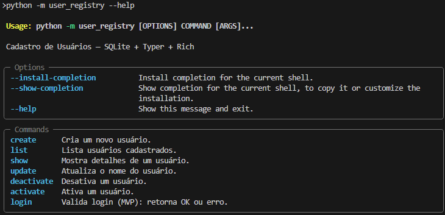
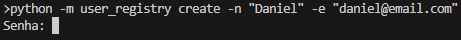
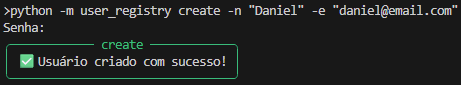
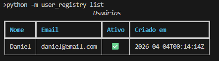
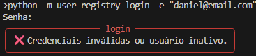
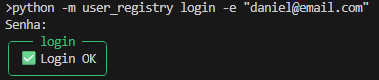
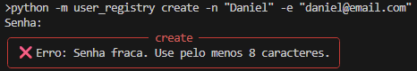

# User Registry (Python) — SQLite + Typer + Rich

[(https://github.com/ImMacaya/User-Registry-PY/actions/workflows/ci.yml/badge.svg?branch=main)](https://github.com/ImMacaya/User-Registry-PY/actions/workflows/ci.yml)


Sistema de cadastro de usuários via terminal, com persistência em SQLite, arquitetura em camadas e segurança básica de senha.

> Projeto estruturado com `src/` layout e instalação em modo editável para facilitar desenvolvimento e testes.

---

## ✨ Features

- CRUD de usuários (create, list, show, update, activate/deactivate)
- Login (MVP): valida e retorna OK/erro
- Senha com hash + salt (PBKDF2)
- CLI bonito com Rich (tabelas e painéis)
- Testes com Pytest
- Arquitetura replicável em C++

---


## 📸 Screenshots (CLI)

> As imagens estão em `docs/screenshots/`.

### Help / comandos disponíveis


### Criação de usuário (início)


### Criar usuário (sucesso)


### Listagem (tabela)


### Login inválido


### Login OK


<details>
<summary><strong>Extras (opcional)</strong> — criação de usuário (falha)</summary>



</details>

---

## 🧱 Estrutura do projeto

```text
src/user_registry/      # código fonte do pacote
tests/                 # testes automatizados
.data/                 # banco SQLite local (ignorado pelo git)
docs/screenshots/      # imagens do README
pyproject.toml         # config do projeto + dependências
.github/workflows/     # CI / automações (GitHub Actions)
.github/ISSUE_TEMPLATE/ # issue forms
.github/               # templates e configs do GitHub
```

---

## 🚀 Instalação (modo desenvolvimento)

### Criar e ativar ambiente virtual

```bash
python -m venv .venv
# Windows PowerShell:
.venv\Scripts\Activate.ps1
# Windows CMD:
.venv\Scripts\activate.bat
```


### Instalar o projeto (editável) + dependências de desenvolvimento

```bash
python -m pip install -e ".[dev]
```

---

## ▶️ Como usar

### Ver comandos disponíveis

```bash
python -m user_registry --help
```

### Criar usuário

```bash
python -m user_registry create -n "Daniel" -e "daniel@email.com"
```

### Listar usuários

```bash
python -m user_registry list
```

### Mostrar detalhes de um usuário

```bash
python -m user_registry show -e "daniel@email.com"
```

### Atualizar nome

```bash
python -m user_registry update -e "daniel@email.com" -n "Daniel R. Macaya"
```

### Desativar / ativar usuário

```bash
python -m user_registry deactivate -e "daniel@email.com"
python -m user_registry activate -e "daniel@email.com"
```

### Login (MVP)

```bash
python -m user_registry login -e "daniel@email.com"
```

---

## 🧪 Testes

```bash
pytest
```

---

## 🧹 Qualidade de código (Ruff)

```bash
ruff check .
ruff format .
```

---

## ✅ Pre-commit (hooks locais)

Instale os hooks uma vez por máquina (com a `.venv` ativa):

```bash
python -m pip install -e ".[dev]"
python -m pre_commit install
```

Rodar manualmente (opcional):
```bash
python -m pre_commit run --all-files
```
> Dica: usar `python -m pre_commit ...` evita problemas de PATH no Windows.

---

## 🤖 Automação (CI + Dependabot)

### CI (GitHub Actions)
O workflow roda automaticamente em **push** e **pull request** no branch `main`, executando:
- `ruff check .`
- `ruff format --check .`
- `pytest`

Arquivo: `.github/workflows/ci.yml`

### Dependabot (atualizações de dependências)
O Dependabot verifica atualizações do ecossistema **pip** e abre PRs automaticamente com updates do `pyproject.toml` (PEP 621). [1](https://doc.nais.io/build/how-to/dependabot-auto-merge/)[2](https://github.blog/changelog/2019-10-28-new-issue-template-configuration-options/)  
Arquivo: `.github/dependabot.yml` [2](https://github.blog/changelog/2019-10-28-new-issue-template-configuration-options/)

### Auto-merge (Dependabot — patch/minor)
PRs do Dependabot com updates **patch/minor** podem ser aprovadas e colocadas em auto-merge (quando os checks do CI passarem).
Arquivo: `.github/workflows/dependabot-auto-merge.yml` [3](https://github.blog/changelog/2023-08-24-grouped-version-updates-for-dependabot-are-generally-available/)[4](https://slar.se/dependabots-dependency-grouping.html)[5](https://deepwiki.com/github/docs/4.3-dependabot-documentation)

---

## 🗃️ Banco de dados

O SQLite é criado automaticamente em:

```text
.data/user_registry.db
```
> Observação: a pasta `.data/` deve estar no `.gitignore`.

---

## 🧭 Arquitetura (camadas)

- **domain**: modelos e validações
- **security**: hash/verificação de senha
- **repository**: acesso ao SQLite
- **service**: regras de negócio
- **presentation**: CLI (Typer + Rich)

---

## 🔒 Segurança

- Senhas não são armazenadas em texto puro.
- O sistema utiliza **hash + salt** com **PBKDF2** para armazenamento e verificação de senha.
- O comando `login` (MVP) apenas valida as credenciais e retorna **OK/erro** (sem geração de token/sessão).

---

## 🧠 Design Decisions (por que essas escolhas?)

- **`src/` layout + instalação editável (`pip install -e ".[dev]"`)**
  Evita imports “acidentais” e garante que testes e execução usam o pacote como seria em produção.

- **Arquitetura em camadas (domain → service → repository → presentation)**
  Mantém regras de negócio isoladas, facilita testes e torna o projeto facilmente replicável em C++.

- **SQLite como persistência**
  Banco embutido, simples de distribuir e ótimo para demonstrar CRUD real sem depender de servidor externo.

- **Typer + Rich no CLI**
  Ajuda/flags amigáveis, saída bonita (tabelas/painéis) e melhor experiência para quem avalia o projeto.

- **Senhas com PBKDF2 (hash + salt)**
  Boas práticas: não armazena senha em texto puro e usa um método robusto disponível na própria standard library.

- **CI com GitHub Actions (ruff + pytest)**
  Garante qualidade automática a cada push/PR e deixa o repositório com padrão profissional.


---

## 🧩 Templates (Issues e Pull Requests)
Este repositório inclui templates para:
- Pull Requests: `.github/pull_request_template.md`
- Issues: `.github/ISSUE_TEMPLATE/`

---

## 📚 Documentação e políticas

**CHANGELOG.md** — histórico de versões e mudanças
**SECURITY.md —** política de reporte de vulnerabilidades
**CONTRIBUTING.md** — guia de contribuição e padrão de commits
**.editorconfig** — padronização de estilo entre editores
**LICENSE** — licença do projeto (MIT)

---

## 🤝 Contribuindo

Contribuições são bem-vindas!

1. Faça um fork do repositório
2. Crie uma branch para sua feature/correção
   `git checkout -b feat/minha-melhoria`
3. Rode os checks localmente antes de enviar:
   ```bash
   ruff check .
   ruff format .
   pytest
   ```
4. Faça commit e push:
    ```bash
    git commit -m "feat: minha melhoria"
    git push origin feat/minha-melhoria
    ```
5. Abra um Pull Request descrevendo o que foi alterado

---

## 🛠️ Troubleshooting (erros comuns)

### `ModuleNotFoundError: No module named 'user_registry'`

- Certifique-se de estar na raiz do projeto (onde está o `pyproject.toml`)
- Reinstale em modo editável:
  ```bash
  python -m pip install -e ".[dev]"
  ```

### VS Code não usa a `.venv`

- Abra a paleta de comandos: `Ctrl + Shift + P`
- Selecione: **Python: Select Interpreter**
- Escolha o interpretador dentro de `.venv`

### PowerShell não ativa a venv (ExecutionPolicy)

Se o PowerShell bloquear a ativação, rode (somente uma vez):

```powershell
Set-ExecutionPolicy -Scope CurrentUser RemoteSigned
```

### Ruff acusa `F401 imported but unused`

- Remova o import não usado **ou** crie um teste/uso para ele
- Para correções automáticas seguras:

```bash
ruff check . --fix
```

### O banco SQLite não aparece / não é criado

- Ao executar comandos do CLI, o arquivo será criado automaticamente em:
  `.data/user_registry.db`
- Confirme se a pasta `.data/` existe e está no `.gitignore`
- Rode um comando do CLI para forçar a criação (ex.: `list`):

```bash
python -m user_registry list
```

---

## 📌 Roadmap

- Replicar o mesmo projeto em C++ (CMake)
- Criar core em C++ e expor para Python via pybind11
- Adicionar logs estruturados e export de relatórios

---

## 👤 Autor

- Daniel Rodrigues Macaya (ImMacaya)

## 📄 Licença

Este projeto está sob a licença **MIT**. Veja o arquivo `LICENSE` para mais detalhes.

---